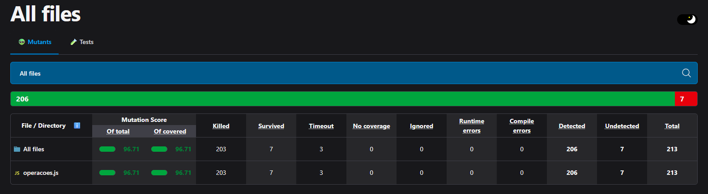

# Relatório de Teste de Mutação (StrykerJS)

## Capa

- Disciplina: Teste de Software
- Trabalho: Análise de Eficácia de Testes com Teste de Mutação
- Nome: Gabrie Faria de Oliveira
- Matrícula: 805560
- Data: 01/11/2025

---

## Resumo 

Partimos de uma execução inicial com mutation score de **73,71%**. Após melhorias na suíte (bordas, mensagens de erro e ramificações lógicas), chegamos a **96,71%** sem exclusão de mutators. Os 7 mutantes remanescentes são majoritariamente equivalentes ou exigiriam alterações de implementação para se tornarem observáveis.

---

## 1) Análise inicial

- Mutation score inicial: **73,71%**  
- Total: 213 | Mortos: 157 | Sobreviventes: 44 | Timeout: 3 | Sem cobertura: 12  
- Cobertura de código (inicial, qualitativa): linhas próximas a 100%, porém ramificações (branches) insuficientes em diversos pontos.

Discrepância cobertura × mutation score: cobertura de linhas indica “o que foi executado”, mas não “quão bem foi verificado”. A suíte inicial privilegiava caminho feliz, validações genéricas de erro e poucos contornos — o que permitiu sobrevivência de mutantes de operador lógico, igualdade e literais de string.

Evidência (visão geral inicial):  


---

## 2) Análise de mutantes críticos (da primeira execução)

1) String literal em `divisao`: mutação troca a mensagem de erro por string vazia; sobreviveu porque o teste usava `toThrow()` genérico, sem validar a mensagem.

2) Operador lógico em `fatorial` (|| → &&): `if (n === 0 || n === 1)` → `if (n === 0 && n === 1)`; difícil de matar porque para 0 ou 1 o resultado continua 1 (equivalência prática em muitos cenários).

3) Igualdade em `clamp` (< → <=, > → >=): ao igualar limites, retorna min/max também na igualdade; sobrevive porque os casos de igualdade já devolvem o mesmo valor.


---

## 3) Solução implementada (o que mudou nos testes)

Abaixo, as estratégias aplicadas (com um único exemplo por item para concisão).

1) Mensagens de erro específicas — validação textual mata StringLiteral/Conditional; aplicado em `divisao`, `raizQuadrada`(-), `maximoArray([])`, `minimoArray([])`, `medianaArray([])`, `inverso(0)`, `fatorial`(-).
```javascript
expect(() => divisao(10, 0)).toThrow('Divisão por zero não é permitida.');
```

2) Bordas e igualdade — diferencia OR/AND e <, <=, >, >=; cobre 0/1 e igualdade em `clamp`.
```javascript
expect(fatorial(0)).toBe(1); expect(fatorial(1)).toBe(1);
```

3) Casos adversários/negativos — expõem ArithmeticOperator/Conditional em aritmética, primalidade e validações.
```javascript
expect(() => raizQuadrada(-9)).toThrow('Não é permitido raiz de número negativo.');
```

4) Coleções vazias — invariantes de agregação e mensagens; cobre Boundary/No-coverage.
```javascript
expect(() => medianaArray([])).toThrow('Array vazio não é permitido.');
```

5) Precisão — tolerância em floats para evitar falsos positivos.
```javascript
expect(celsiusParaFahrenheit(0)).toBeCloseTo(32, 5);
```

6) Completude de caminhos — executa ramos true/false e early-returns (ex.: `clamp`).
```javascript
expect(clamp(4, 5, 10)).toBe(5); expect(clamp(7, 5, 10)).toBe(7); expect(clamp(11, 5, 10)).toBe(10);
```

Cobertos: StringLiteral, LogicalOperator, EqualityOperator, ArithmeticOperator e Boundary.


## 4) Resultados finais 

213 mutantes: 203 mortos, 3 timeout, 7 sobreviventes — mutation score **96,71%**.  
  
Relatório HTML completo: `reports/mutation/mutation.html`.

---

## 5) Conclusão

Os resultados confirmam que o teste de mutação é um indicador mais robusto do que a simples cobertura de linhas: saímos de 73,71% para 96,71% ao fortalecer oráculos (mensagens de erro), exercitar bordas e separar caminhos lógicos relevantes. O ganho veio menos de “mais testes” e mais de “testes melhores”, com assertivas específicas e casos de contorno que expõem mutações sutis (LogicalOperator, Equality, StringLiteral). Os 7 sobreviventes remanescentes tendem a ser equivalentes ou exigiriam mudanças de design para se tornarem observáveis. Perseguir >98% sem exclusões é viável, mas com trade-offs: maior acoplamento teste–implementação, asserts frágeis ou alteração de API.

Como práticas recomendadas, mantemos: mensagens de erro estáveis e verificadas; contratos explícitos para entradas inválidas; cobertura dos limites (igualdade em clamp, 0/1 no fatorial); e tolerância em cálculos de ponto flutuante. No processo, vale institucionalizar o Stryker no pipeline (CI) para evitar regressões e monitorar continuamente a eficácia da suíte. Próximos passos: revisar cada sobrevivente, decidir se é equivalente (documentar/excluir) ou se compensa um pequeno refactor para torná-lo observável; complementar a análise com métricas de branch coverage.

Em suma, a suíte agora testa o que importa e falha quando deve; o mutation score reflete essa maturidade e passa a servir como guarda-corpo de qualidade para as próximas evoluções do projeto.


